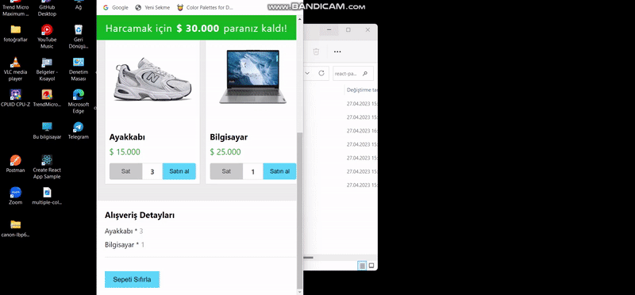

<h5>React etkin bir şekilde kullanılarak para harcama hesaplayıcısı hazırlandı.</h5>
<h4>Kullanılan Teknolojiler</h4>
<h3>React.js,Css</h3>

     Dinamik birşekilde elimizde olan para alışveriş yaptıkça azaldı ve ne kadar param kaldığını ekrana yazdı. Tekrardan sat
     butonlarıyla sepettten çıkarıldı. Para bitince uyarı verdi "PARAN BİTTİ..."şeklinde.
     Sayfanın Aşağısında oluşturulan  tablo ile kaç tane ürünü ne kadara aldığımızı yine react ile dinamik bir şekilde 
     gösterdik. Sepeti boşalt butonuyla tekrar sepeti boşalttıp alışverişe dönebildik.
     içerisinde bulunan alışveriş listesi json yapısı ile oluşturuldu.
  

